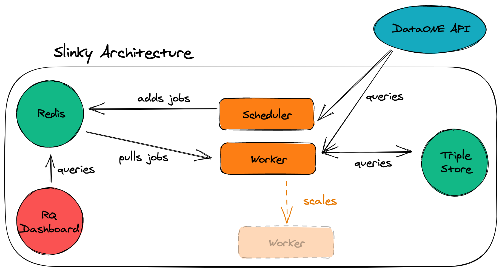

# Slinky, the DataONE Graph Store

## Overview

Service for the DataONE Linked Open Data graph.

This repository contains the deployment and code that makes up the
DataONE graph store.

The main infrastructure of the service is composed of four services and is essentially a backround job system ([RQ](https://python-rq.org/)) hooked into an RDF triplestore ([Virtuoso](http://vos.openlinksw.com/owiki/wiki/VOS)) for persistence:

1. `virtuoso`: Acts as the backend graph store
2. `scheduler`: An [APSchduler](https://apscheduler.readthedocs.org) process that schedules jobs (e.g., update graph with new datasets) on the `worker` at specified intervals
3. `worker`: An [RQ](http://python-rq.org/) worker process to run scheduled jobs
4. `redis`: A [Redis](http://redis.io) instance to act as a persistent store for the `worker` and for saving application state



As the service runs, the graph store will be continuously updated as datasets are added/updated on [DataOne](https://www.dataone.org/). Another scheduled job exports the statements in the graph store and produces a Turtle dump of all statements at [http://dataone.org/d1lod.ttl](http://dataone.org/d1lod.ttl).

### Contents of This Repository

```
.
├── d1lod       # The code that handles the graph updates
├── deploy      # The Kubernetes deployment files
├── docs         # Detailed documentation beyond this file
```

## What's in the graph?

For an overview of what concepts the graph contains, see the [mappings](/docs/mappings.md) documentation.

## Deployment

The deployment is agnostic of startup sequence, but the `make` tool
provided is an easy way to manage the stack.
 
To deploy with `make`, navigate to the `deploy/` directory and run `make
help` for a complete list of commands.

Alternatively, each deployment file can be applied using `kubectl apply
-f <filename>`.


### Virtuoso

#### Deployment

The virtuoso deployment is a custom image that includes a runtime script
for enabling sparql updates. This command is run alongside the Virtuoso
startup script in a different process and completes when the Virtuoso
server comes online. This subsystem fully automated and shouldn't need
manual intervention during deployments.

#### Protecting the Virtuoso SPARQLEndpoint

In order to protect the `sparql/` endpoint that Virtuoso exposes, follow
[this](http://vos.openlinksw.com/owiki/wiki/VOS/VirtSPARQLProtectSQLDigestAuthentication)
guide from Open Link. While performing 'Step 6', use the `Browse` button
to locate the authentication function rather than copy+pasting
`DB.DBA.HP_AUTH_SQL_USER;`, which is suggested by the guide. _This
should be done for all new production deployments_.

### Scaling Workers

For high workloads, the workers can be scaled with

```
kubectl scale --replicas=3 deployments/{dataset-pod-name}
kubectl scale --replicas=3 deployments/{default-pod-name}
```


## Testing

Tests are written using [PyTest](http://pytest.org/latest/). Install [PyTest](http://pytest.org/latest/) with

```
pip install pytest
cd d1lod
pytest
```

As of writing, only tests for the supporting Python package (in directory './d1lod') have been written.

### docker-compose
It's possible to run the unit tests using the docker-compose file
included in the `./d1lod` folder. To run the dockerized unit tests,

1. git clone
2. `cd d1lod`
3. `docker-compose up`
4. docker exec -it <slinky container id> bash
5. `cd /tmp`
6. `pip install pytest`
7. `pytest`

To test local changes, build the slinky image using the provided
dockerfile in `./d1lod`. Modify the docker-compose file to use the local
image before starting the stack.
