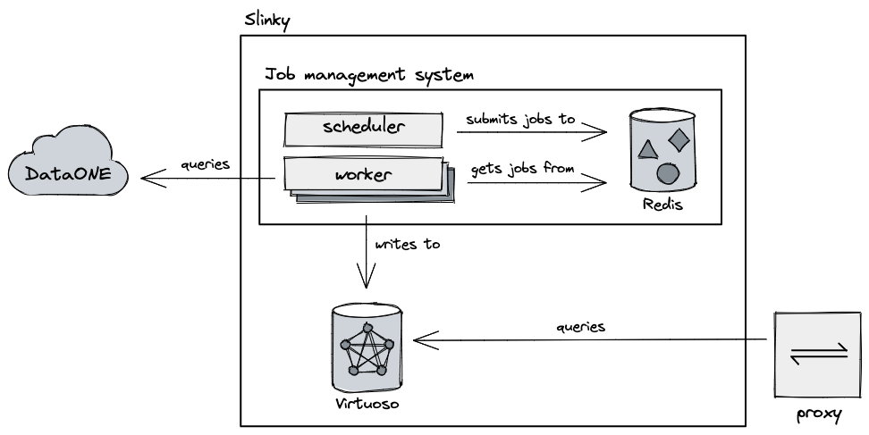

# Slinky, the DataONE Graph Store

[](https://github.com/dataone/slinky/actions/workflows/pytest.yaml)

A Linked Open Data interface to [DataONE](https://dataone.org) designed to run on [Kubernetes](https://kubernetes.io).

## Overview

Slinky is essentially just a backround job system hooked up to an RDF triplestore that converts DataONE's holdings into Linked Open Data.

It's made up of five main components:

1. `web`: Provides a public-facing API over Slinky
2. `virtuoso`: Acts as the backend graph store
3. `scheduler`: An [RQScheduler](https://github.com/rq/rq-scheduler) process that enqueues repeated jobs in a cron-like fashion
4. `worker`: One or more [RQ](http://python-rq.org/) processes that runs enqueues jobs
5. `redis`: A [Redis](http://redis.io) instance to act as a persistent store for the `worker` and for saving application state



As the service runs, the graph store will be continuously updated as datasets are added/updated on [DataOne](https://www.dataone.org/).

### Contents of This Repository

```text
.
├── slinky  # Python package used by services
├── docs   # Documentation
├── helm   # A Helm chart for deploying on Kubernetes
```

## What's in the graph?

For an overview of what concepts the graph contains, see the [mappings](/docs/mappings.md) documentation.

## Deployment

Slinky is primarily designed for deployment on the DataONE [Kubernetes](https://kubernetes.io/) cluster.
However, a [Docker Compose](https://docs.docker.com/compose/) file has been provided for anyone that doesn't have a cluster readily available but still wants to run Slinky.

### Deployment on Kubernetes

To make installing Slinky straightforward, we provide a [Helm](https://helm.sh) chart.

Pre-requisites are:

- A [Kubernetes](https://kubernetes.io) cluster
- [Helm](https://helm.sh)

Install the Chart by running:

```sh
cd helm
helm install $YOUR_NAME .
```

See the [README](./helm/README.md) for more information, including how to customize installation of the Chart to support Ingress and persistent storage.

### Local Deployment with Docker Compose

To deploy Slinky locally using [Docker Compose](https://docs.docker.com/compose/), run:

```sh
docker compose up
```

After a few minutes, you should be able to visit http://localhost:9181 to see the worker management interface and see work being done or http://localhost:8080 to send SPARQL queries to the endpoint.

### Virtuoso

The virtuoso deployment is a custom image that includes a runtime script
for enabling sparql updates. This command is run alongside the Virtuoso
startup script in a different process and completes when the Virtuoso
server comes online. This subsystem is fully automated and shouldn't need
manual intervention during deployments.

#### Protecting the Virtuoso SPARQLEndpoint

In order to protect the `sparql/` endpoint that Virtuoso exposes, follow
[this](http://vos.openlinksw.com/owiki/wiki/VOS/VirtSPARQLProtectSQLDigestAuthentication)
guide from Open Link. While performing 'Step 6', use the `Browse` button
to locate the authentication function rather than copy+pasting
`DB.DBA.HP_AUTH_SQL_USER;`, which is suggested by the guide. _This
should be done for all new production deployments_.

### Scaling Workers

To scale the number of workers processing datasets beyond the default, run:

```sh
kubectl scale --replicas=3 deployments/{dataset-pod-name}
```

## Testing

A test suite is provided for the `slinky` Python package used by workers.
Tests are written using [pytest](http://pytest.org).

See the [slink README](./slinky/README.md) for more information.
