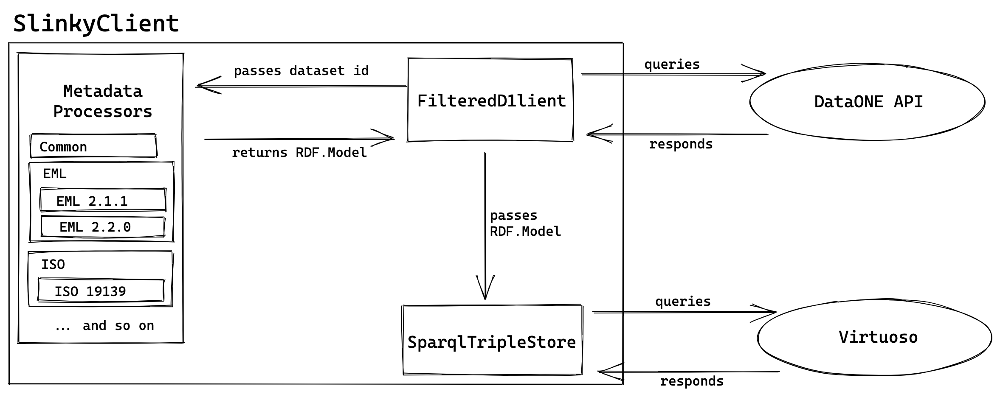

# d1lod

This directory contains the Python package that supports Slinky.
The package is currently called 'd1lod' but might be renamed in the future.

## Status

The codebase is currently being cleaned up and is not as thoroughly tested as the previous codebase.
The code you see in `./d1lod` is the cleaned up code and the old codebase has
been kept at `./d1lod/legacy` for reference.
The tests are `./tests` are a mix of test against the new code and legacy code.

### TODOS

- [x] Refactor classes from prevous Graph+Interface structure
- [x] Create a CLI to easily interact with Slinky
- [ ] Implement more Processor to match more DataONE format IDs
- [ ] Implement Processors to match Mappings
- [ ] Provide easy way to configure connection information (d1client, triplestore, redis)

## Architecture

`d1lod` is made of a few key classes, the most important of which is `SlinkyClient`:

- `SlinkyClient`: Entrypoint class that manages a connection to DataONE, a triple store, and Redis for short-term persistence and delayed jobs
- `FilteredCoordinatingNodeClient`: A view into a Coordinating Node that can limit what content appears to be available based on a Solr query. e.g., a CN client that can only see datasets that are part of a specific EML project or in a particular region
- `SparqlTripleStore`: Handles inserting into and querying a generic SPARQL-compliant RDF triplestore via SPARQL queries. Designed to be used with multiple triple stores.
- `Processor`: Set of classes that convert documents of various formats (e.g., XML, JSON-LD) into a set of RDF statements
- `jobs`: Set of routines for use in a background job scheduling system. Currently `rq`.

The `SlinkyClient` is the main entrypoint for everything the package does and handles connections to require services.
See the following diagram to get a sense of the interaction between the classes:



## Usage

### Installation

`d1lod` isn't intended for broad usage so it won't end up on https://pypi.org/.
You can install it locally with

```
pip install .
```

### Usage

The most common routines `d1lod` provides can be used from the command line with the `slinky` executable.
After installation, type:

```
slinky --help
```

You can get a Turtle-formatted description of a DataONE dataset with:

```
slinky get doi:10.5063/F1N58JPP
```

## Development

All Python source files should be formatted with [Black](https://black.readthedocs.io) and linted with [Flake8](https://flake8.pycqa.org/).

### Dependencies

This package is a bit harder to set up than normal Python projects because it uses the [librdf](https://librdf.org/bindings/) (Redland) Python bindings which aren't on PyPi and require manual installation.
You should install the Redland Python bindings as appropriate on your system.
Under macOS, see [our guide](./docs/install-redlands-bindings.md).

The rest of this package's dependencies are installed when you run `pip install .`.
Installing the package in editable mode is recommended:

```
pip install -e .
```

Note: virtualenvs are really nice but I haven't found a way to easily use them with Redland so I tend to develop without them.
Let me know if you have any ideas.

### Testing

Testing is impelemented with [pytest](https://pytest.org).

To run the unit tests, install pytest and run:

```sh
pytest
```

Note: By default, running `pytest` will run only the units tests.
The test suite also includes a good number of integration tests which depend on other services and/or a network connection to succeed.
Integration tests are decorated with `@pytest.mark.integration`, like

```python
@pytest.mark.integration
def test_my_integration_test():
    pass
```

To run all tests, including integration tests, run:

```sh
pytest --integration
```

See [Integration Tests](#integration-tests) for details on setting up an environment for running them.

#### Integration tests

The integration test suite can be run with:

```
pytest --integration
```

These tests depends on external services, including services running locally and externally.
The most straightforward way to set up your local environment to run the integration tests is by using [Docker](https://www.docker.com/) and [Docker Compose](https://docs.docker.com/compose/) and running:

```
docker compose up -d
```

Note: Depending on your network connection, it will take a while to pull the necessary images. Services may also take a few minutes to become full responsive before the integration test suite will run successfully.

### Guidelines

It's helpful to write down some guidelines to help keep codebases internally consistent.
Note: This section is new and I'm hoping to add things here as we go.

- In `Processor` classes, prefer throwing exceptions over logging and continuing when you encounter an unhandled state. The processors run in a delayed job system and so there's no harm in throwing an unhandled exception and it makes it easy to find holes in processing code.
- Try not to hard-code any term URIs and instead use RDFLib's [Namespace](https://rdflib.readthedocs.io/en/stable/namespaces_and_bindings.html) class. Add new namespaces to `namespaces.py.
