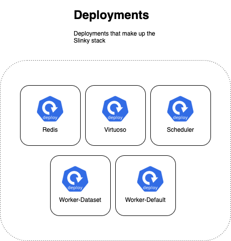
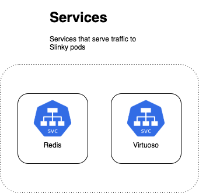
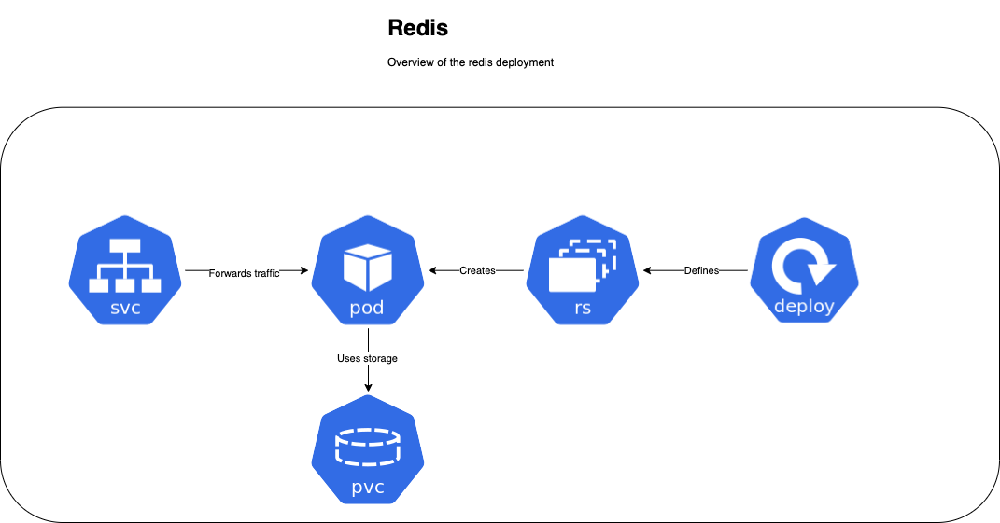
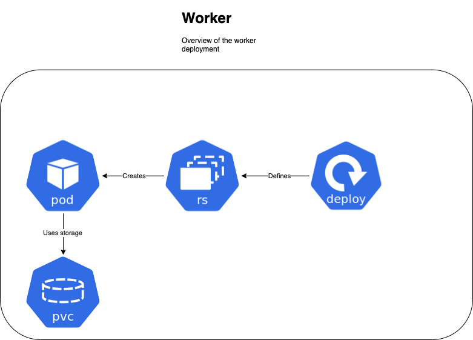
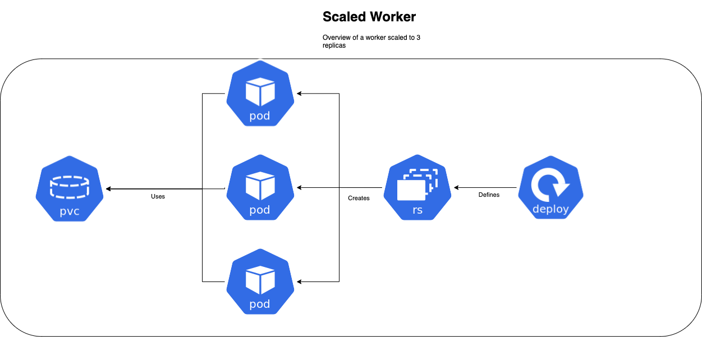
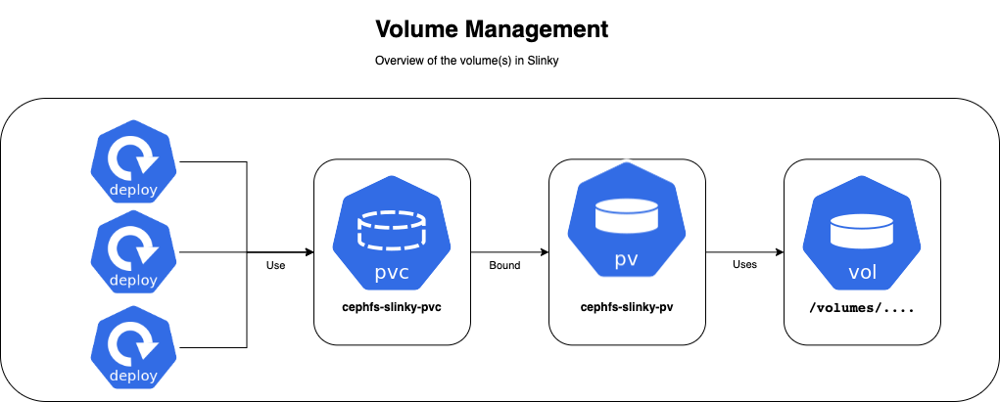

# Kubernetes Deployment

## Architecture

At a high level, the Slinky stack is a collection of five deployments
and two services shown below.

### Deployments

In general, the deployments in Slinky are all very similar, which should
be visually clear in the architecture diagrams below.

#### With Services
These deployments need to accept connections from other applications,
which might be end users _or_ other applications in the stack. Because
of this requirement, these deployments are associated with a service.
    

#### Without Services

These deployments don't handle traffic from exernal applications, hence
the deployment diagrams are without services. 

When a worker deployment is scaled, the vertical scaling is evident in
the following diagram which shows a worker deployment with a replica
count of 3.

### Filesystem Artifacts

All of the Slinky deployments use a single volume claim which has space
allocated on the CephFS system, shown below.

