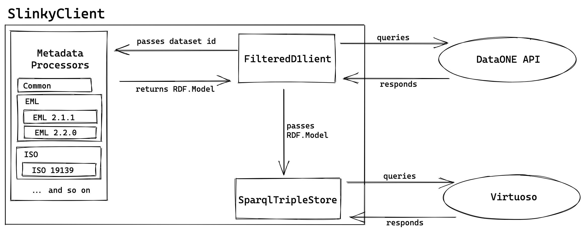

# SlinkyClient

The core of Slinky is the SlinkyClient.
SlinkyClient handles communication with DataONE, the backing RDF triple store, and the background job system.

Note: There's a chance this might be a bit out of date and need updating.

